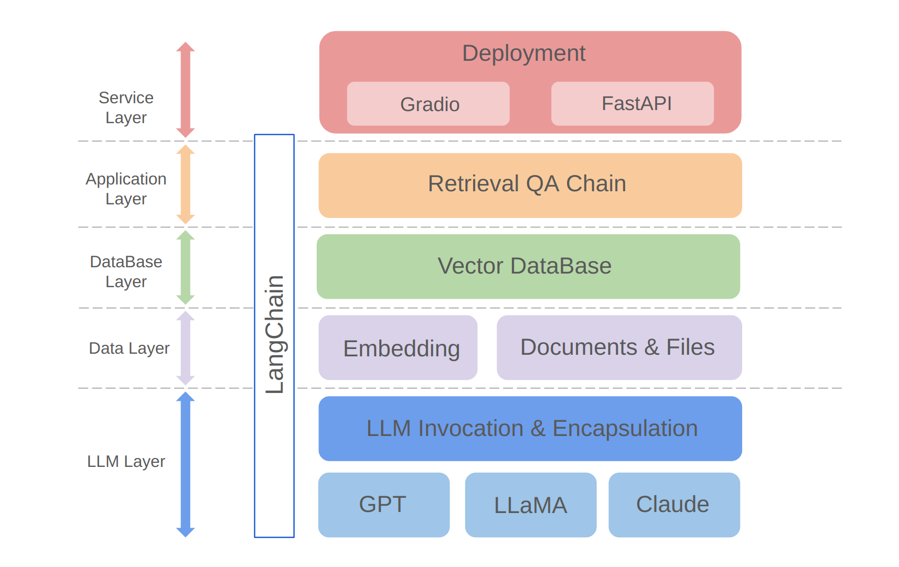

# Bookshelf-QABot


# Personal Knowledge Base Assistant Project
**Welcome to Bookshelf-QABot, it is a Personal Knowledge Base Assistant Project, a RAG solution** designed to streamline your access to vast amounts of information quickly and accurately using the power of large language models. This versatile tool is perfect for researchers, business owners, and anyone in need of efficient information management. Its scalability makes it ideal for businesses looking to enhance their customer service capabilities, providing quick and accurate responses to customer inquiries. Whether you are optimizing individual productivity or enhancing a business operation, this project is tailored for you.


## I. Main Features

- **Interactive Q&A with RAG**: Leverage the Retrieval-Augmented Generation (RAG) architecture to facilitate dynamic and precise question answering. 

- **Visualization Interfaces**: Provides easy-to-navigate interfaces via Gradio and APIs via FastAPI for starting the project, demonstrating Q&A, and showcasing examples.

- **Customized Knowledge Management**: Offers personalization options to tailor the knowledge base to your preferences. Users can upload and vectorize their own ducoments to build a unique "Bookshelf" that deal with certain domain-specific information.

- **Multi-Model Compatibility**: Supports seamless switching between multiple Large Language Models (LLMs) such as GPT-3.5, GPT4, and more. This flexibility allows users to choose the best model for specific tasks, optimizing accuracy, response speed and cost.


## II. Getting Started


### 1. Installation & Configuring

**Clone and set up the project:**

```bash
git clone https://github.com/zhang-shizhe/Bookshelf-QABot
cd Bookshelf-QABot
conda create -n bookshelf-qabot python==3.10.14
conda activate bookshelf-qabot
pip install -r requirements.txt
```
**Set up the API key**

Get API key from [OpenAI](https://platform.openai.com/), and create a .env file under root directory. Copy and paste the api string with the following format.
```bash
OPENAI_API_KEY="you openai api key string"
```

### 2. Usage
Start the local API server:
```
cd app
uvicorn api:app --reload
```
Or you can simply run
```
bash app/run_api.sh
```
Run the project via gradio:

```shell
python app/run_gradio.py
```


## III. Development and Architecture
### Architecture Overview

This project leverages a full-stack approach  based on large language models, built on the LangChain framework. The core technology includes LLM API calls, RAG, vector databases, and retrieval Q&A chains. The overall architecture of the project is as follows:



As shown above, the project is structured from the bottom up into the LLM layer, data layer, database layer, application layer, and service layer.

① The LLM layer mainly involves the encapsulation of LLM calls for several popular LLM APIs and models, allowing users a unified entrance and way to access different models, supporting on-the-fly model switching;

② The data layer mainly includes the source data of the personal knowledge base and the Embedding API, where the source data after embedding processing can be used by the vector database;

③ The database layer is mainly based on the vector database built on the personal knowledge base source data, for which I chose Chroma in this project;

④ The application layer is the top-layer encapsulation of core functions, where we further encapsulated based on the retrieval Q&A chain base class provided by LangChain, thereby supporting different model switches and facilitating the implementation of database-based retrieval Q&A;

⑤ The top layer is the service layer, where I implemented Gradio to build demos and FastAPI to assemble APIs to support the project's service access.

## IV. Contribute
Thank you for your interest in this project. I am looking forward to your contributions and seeing how you'll use it to enhance your information management and retrieval tasks or scale it up for business applications like customer service!